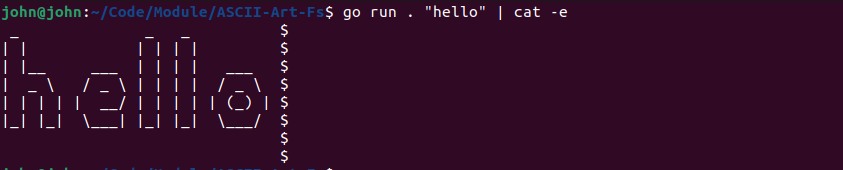
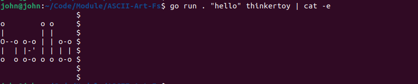
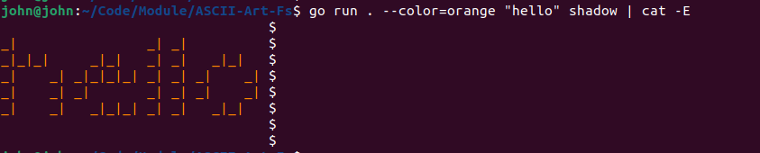
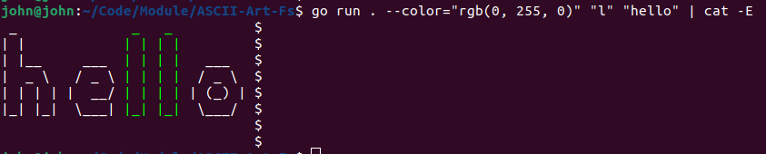

# ASCII-Art-Fs

[](https://opensource.org/licenses/MIT)

This project is a continuation of ASCII-Art-Color. The project is capable of changing the font style of output displayed on the terminal

## Table of Contents

- [Features](#features)

- [Installation](#installation)

- [Usage](#usage)

- [Examples](#examples)

- [Credits](#credits)

## Features

- Prints ASCII characters based on input text provided(available characters are from 32 - 126).

- Supports different banner fonts for ASCII art.

- Supports choosing font color of output displayed in the terminal

**NOTE**: Consider using RGB() format when specifying a wide range of colors. Other colors supported by the project are limited to:

```
red
green
blue
orange
yellow
black
white
pink
teal
purple
brown
beige
indigo
violet
maroon
cream
```

## Installation

1. Clone the repository:

   ```
   $ git clone https://github.com/johneliud/ASCII-Art-Fs
   ```

2. Navigate into the directory:
   ```
   $ cd ASCII-Art-Fs
   ```

## Usage

- The program can be run in a variety of ways as listed below:

  ```
  $ go run . <input_text>
  ```

  or

  ```
  $ go run . <input_text> <banner>
  ```

  or

  ```
  $ go run . --color=<color> <input_text>
  ```

  or

  ```
  $ go run . --color=<color> <substring> <input_text>
  ```

  or

  ```
  $ go run . --color=<color> <substring> <input_text> <banner>
  ```

- input_text: Refers to the text to be converted to ASCII format

## Examples

- Print "hello" in ASCII art

  ```
  $ go run . "hello" | cat -e
  ```

- Output
  

- Print "hello" in ASCII art using "thinkertoy" banner font/file

  ```
  $ go run . "hello" thinkertoy | cat -e
  ```

- Output
  

- Print "hello" in ASCII art using "shadow" banner file/font and using an orange font color

  ```
  $ go run . --color=orange "hello" shadow | cat -E
  ```

- Output
  

- Print "hello" in ASCII art using the default banner font/file. The substring "l" in the input text should be colored green

  ```
  $ go run . --color="RGB(0, 255, 0) "l" "hello" | cat -E
  ```

- Output
  

## Credits

This project was made possible alongside:

- [Joab Owala](https://github.com/joabowala)

- [Denil Anyonyi](https://github.com/denilany)

## Contact

Incase of any enquiry, please feel free to reach out to me via the email address: johneliud4@gmail.com